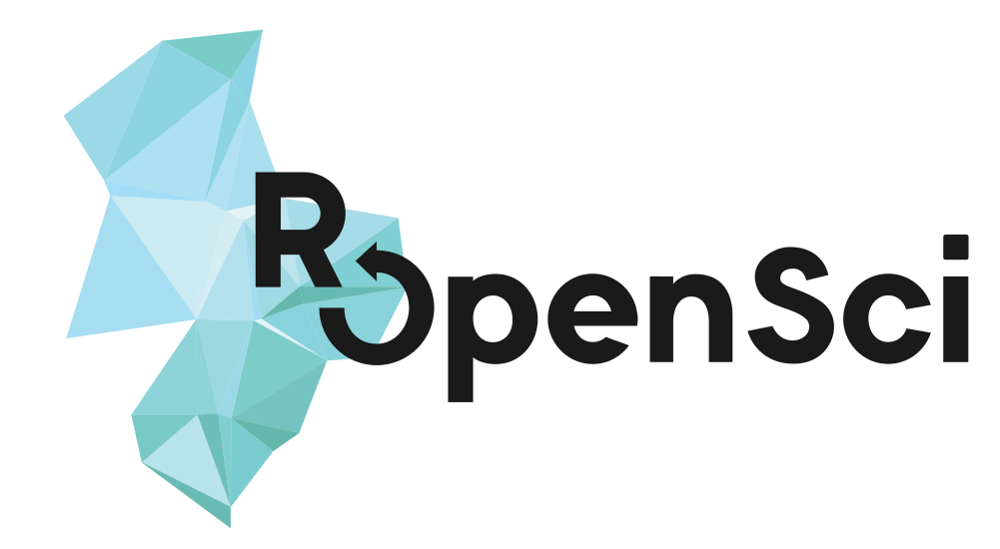

```{r xaringan, include = FALSE}
library(xaringanthemer)
source ("myxaringantheme.R")
```

```{r setup, include=FALSE}
options(htmltools.dir.version = FALSE)# suppress version num in subdir name

knitr::opts_chunk$set(cache = TRUE,
                      warning = FALSE)
                      #message = FALSE)
```

class: left, middle, inverse


.left-column[
`r icon::fa_github(size = 2, animate = "spin")` mpadge

`r icon::fa_github(size = 2, animate = "spin")` ropensci
]

.right-column[
`r icon::fa_twitter(size = 2, animate = "spin")` bikesRdata

`r icon::fa_envelope(size = 1)` .small[mark@ropensci.org]<br><br>

`r icon::ii_ios_world_outline(size = 5)` mpadge.github.io
]

.box-bottom[
slides at <br>
[https://github.com/mpadge/satRday-neuchatel-2020](https://github.com/mpadge/satRday-neuchatel-2020)
]

---

[](https://ropensci.org)


---

## rOpenSci packages

```{r ros-registry}
url <- "https://ropensci.github.io/roregistry/registry.json"
x <- jsonlite::fromJSON(url)$packages
names (x)
nrow (x)
```

---

## rOpenSci package categories

```{r ros-registry-categories-fake, eval = FALSE}
table (x$ropensci_category)
```
```{r ros-registry-categories, echo = FALSE}
res <- table (x$ropensci_category)
print (data.frame (category = names (res),
                   n = as.integer (res)),
       row.names = FALSE)
```

---
class: center

```{r, echo = FALSE}
knitr::include_graphics ("./images/ropensci-logo.svg")
```

.large[
[github.com/ropensci](https://github.com/ropensci) <br>
[ropensci.org](https://ropensci.org)
]


---
class: center

```{r, echo = FALSE}
knitr::include_graphics ("./images/ropensci-logo.svg")
```

.large[
What can you do to engage with rOpenSci?
]

---
background-image: url(images/ropensci-bg.svg)
background-size: contain
background-position: 0% 50%

## What can you do to engage with rOpenSci?

### As a package user

- Give feedback on [discuss.ropensci.org](https://discuss.ropensci.org) or via
  github issues
- Submit a Use Case to [discuss.ropensci.org](https://discuss.ropensci.org)
- Participate in regular [Community Calls](https://ropensci.org/commcalls)
- Ping @ropensci on twitter --- along with package authors

---
background-image: url(images/ropensci-bg.svg)
background-size: contain
background-position: 0% 50%

## What can you do to engage with rOpenSci?

### As a developer

- Read the [rOpenSci Developer Guide](https://devguide.ropensci.org/contributingguide.html)

---
background-image: url(images/ropensci-bg.svg)
background-size: contain
background-position: 0% 50%

## What can you do to engage with rOpenSci?

> 15.1 Why contribute to rOpenSci packages?
>
> In general, as explained by Kara Woo in her talk at the CascadiaR conference,
contributing to R packages allows you to make things work the way you want (by
adding some functionality to your favorite package), can lead to opportunities
and allows you to learn about package development.
>
> ... we strive to make contributing a good experience... we are creating
social infrastructure through a welcoming and diverse community

---
background-image: url(images/ropensci-bg.svg)
background-size: contain
background-position: 0% 50%

## What can you do to engage with rOpenSci?

### As a code contributor

- Read the [rOpenSci Developer Guide](https://devguide.ropensci.org)
- Use packages, contribute to or open<br>issues, make pull requests

### As a developer

- Offer to help with / help maintain a package
- Develop your own package
- Open a pre-submission enquiry (= issue) on
  [github.com/ropensci/software-review](https://github.com/ropensci/software-review)

---
background-image: url(images/ropensci-bg.svg)
background-size: contain
background-position: 0% 50%

## rOpenSci Software Categories

```{r ros-registry2, echo = FALSE}
url <- "https://ropensci.github.io/roregistry/registry.json"
x <- jsonlite::fromJSON(url)$packages
res <- table (x$ropensci_category)
res <- data.frame (category = names (res),
                   n = as.integer (res),
                   stringsAsFactors = FALSE)
print (res, row.names = TRUE)
```

--

... but [R is a language for statistics](https://github.com/ropensci/software-review/issues/331), right?

---
background-image: url(images/ropensci-bg.svg)
background-size: contain
background-position: 0% 50%
class: center, middle

```{r sloan, echo = FALSE, fig.width = 12, fig.height = 6}
knitr::include_graphics ("./images/sloan.svg")
```


---
background-image: url(images/ropensci-bg.svg)
background-size: contain
background-position: 0% 50%

## rOpenSci peer-review of statistical software

### Why Not? Because it's really difficult

### Why? Because its really important

--

- The [R Validation Hub](https://www.pharmar.org/about/) are doing it, but
  exclusively<br>for the bio-pharmaceutical industry.

- We will be (co-)developing a generalised methodology

--

- The [R Validation Hub](https://www.pharmar.org/about/) has 44 organisations yet relatively little money
- rOpenSci has a board of 6 members, around 1.5 full-time staff, and some money


---
background-image: url(images/ropensci-bg.svg)
background-size: contain
background-position: 0% 50%

## rOpenSci peer-review of statistical software

> We’ll be working with the new board and the broader statistical software
community to develop a set of agreed-upon standards for statistical package
implementation and testing, then launching a new peer-review process and
testing tools. (rOpenSci blog 15 July 2019)


---
background-image: url(images/ropensci-bg.svg)
background-size: contain
background-position: 0% 50%

## rOpenSci peer-review of statistical software

### ~~Why Not? Because~~ it's really difficult

--

.left-column[
- Bayesian & Monte Carlo
- Dimensionality & Feature Reduction
- Machine Learning
- Regression, Splines, & Interpolation
- Statistical Indices and Scores
- Visualisation
- Probability Distributions
]

.right-column[
- Wrapper Packages
- Categorical Variables
- Networks
- Exploratory Data Analysis (EDA)
- Survival Analysis
- Workflow Software
- Summary Statistics
- Spatial Analysis
- Educational Software
]

---
background-image: url(images/ropensci-bg.svg)
background-size: contain
background-position: 0% 50%

## rOpenSci peer-review of statistical software

> We’ll be working with the new board and the broader statistical software
community to develop a set of agreed-upon standards for statistical package
implementation and testing, then launching a new peer-review process and
testing tools. (rOpenSci blog 15 July 2019)


---
background-image: url(images/ropensci-bg.svg)
background-size: contain
background-position: 0% 50%

## rOpenSci peer-review of statistical software

"agreed-upon standards for statistical package implementation and testing"

.left-column[
- Bayesian & Monte Carlo
- Dimensionality & Feature Reduction
- Machine Learning
- Regression, Splines, & Interpolation
- Statistical Indices and Scores
- Visualisation
- Probability Distributions
]

.right-column[
- Wrapper Packages
- Categorical Variables
- Networks
- Exploratory Data Analysis (EDA)
- Survival Analysis
- Workflow Software
- Summary Statistics
- Spatial Analysis
- Educational Software
]

---
background-image: url(images/ropensci-bg.svg)
background-size: contain
background-position: 0% 50%

## rOpenSci peer-review of statistical software

"agreed-upon standards for ~~statistical package implementation and~~ testing"

.left-column[
- Bayesian & Monte Carlo
- Dimensionality & Feature Reduction
- Machine Learning
- Regression, Splines, & Interpolation
- Statistical Indices and Scores
- Visualisation
- Probability Distributions
]

.right-column[
- Wrapper Packages
- Categorical Variables
- Networks
- Exploratory Data Analysis (EDA)
- Survival Analysis
- Workflow Software
- Summary Statistics
- Spatial Analysis
- Educational Software
]


---
background-image: url(images/ropensci-bg-dark.png)
background-size: contain
background-position: 0% 50%
class: inverse

# TESTING


---
background-image: url(images/ropensci-bg.svg)
background-size: contain
background-position: 0% 50%

## What is testing?

### Concrete Testing

Testing of concrete inputs and outputs

### Property-based Testing

Testing functional responses based on the general *properties* of their inputs
and outputs


---
background-image: url(images/ropensci-bg.svg)
background-size: contain
background-position: 0% 50%

## What is testing? - Alternative approaches

### Concrete Testing

- R via `testthat` and a few other packages

- python via `pytest` and lots of other packages

- inbuilt in `rust` (the benchmark)

### Property-based Testing

- `python` via [`hypothesis`](https://hypothesis.works/) (the benchmark)

- `rust` via [`quickcheck`](https://github.com/BurntSushi/quickcheck),
  [`proptest`](https://lib.rs/crates/proptest), and others

---
background-image: url(images/ropensci-bg.svg)
background-size: contain
background-position: 0% 50%

## What might property-based testing look like?

### Typical `roxygen` function documentation lines

```{r testing-ex1, eval = FALSE}
#' @param x The first input
#' @param y The second input
#' @param z The third and last input
#' @return The output value
#' @export
f <- function(x, y, z) {
    # function definition
}
```

--

`roxygen2` is extensible, and the [`roxytest`
package](https://github.com/mikldk/roxytest) enables concrete tests to be
specified directly in function documentation.

---
background-image: url(images/ropensci-bg.svg)
background-size: contain
background-position: 0% 50%

## What might property-based testing look like?

### Typical `roxygen` function documentation<br>plus property-based testing lines

```{r testing-ex2, eval = FALSE}
#' @param x The first input
#' @param y The second input
#' @param z The third and last input
#' @return The output value
#' @export
#'
#' @given x integer
#' @given y numeric
#' @given z character
#' @expect is.integer(f(x, y, z))
#' @expect length(f(x, y, z)) == 1
f <- function(x, y, z) {
    # function definition
}
```


---
background-image: url(images/ropensci-bg.svg)
background-size: contain
background-position: 0% 50%

## What might property-based testing look like?

```{r testing-ex4, eval = FALSE}
f <- function(x, y, z) {
    # function definition
}

for (i in seq(ntrials)) {
    x <- ceiling(runif(1, min = -Inf, max = Inf))
    y <- runif(1, min = -Inf, max = Inf)
    tryCatch (
        res <- f(x, y, z = "<string>"),
              error = function(e) e
              )
}
```

Property-based testing tests responses<br>to ranges of input values


---
background-image: url(images/ropensci-bg.svg)
background-size: contain
background-position: 0% 50%

## What might property-based testing look like?

```{r testing-ex5, eval = FALSE}
f <- function(x, y, z) {
    # function definition
}

for (i in seq(ntrials)) {
    tryCatch (
        len <- ceiling(runif(1e6))
        x <- ceiling(runif(len, min = -Inf, max = Inf))
        y <- runif(1, min = -Inf, max = Inf)
        res <- f(x, y, z = "<string>"),
              error = function(e) e
              )
}
```

Property-based testing tests responses<br>to structures of input values


---
background-image: url(images/ropensci-bg.svg)
background-size: contain
background-position: 0% 50%

## What might property-based testing look like?

```{r testing-ex6, eval = FALSE}
#' @given x integer
#' @given y numeric
#' @given z character
#' @given length(x) <= 10
#' @given res = f(x, y, z)
#' @expect res is silent
f <- function(x, y, z) {
    # function definition
}
```


---
background-image: url(images/ropensci-bg.svg)
background-size: contain
background-position: 0% 50%

## What might property-based testing look like?

```{r testing-ex7, eval = FALSE}
#' @given x integer
#' @given y numeric
#' @given z character
#' @given length(x) <= 10
#' @given res = f(x, y, z)
#' @expect res is silent
#'
#' @given length(x) == 10
#' @given res = f(x, y, z)
#' @expect res is silent
#' @report res is error
f <- function(x, y, z) {
    # function definition
}
```

- Bug reports use the same grammar as tests

---
background-image: url(images/ropensci-bg.svg)
background-size: contain
background-position: 0% 50%

## What might property-based testing look like?

```{r testing-ex8, eval = FALSE}
#' @given x integer
#' @given y numeric
#' @given z character
#' @given length(x) <= 10
#' @given res = f(x, y, z)
#' @expect res is silent
#'
#' @given viz = TRUE
#' @report f(x, y, z, viz) is error
#' @request f(x, y, z, viz) produces interactive graphical output
f <- function(x, y, z, int) {
    # function definition
}
```

- Feature requests use the same grammar as tests

--

- Feature requests are pull requests are direct code contributions

---
background-image: url(images/ropensci-bg.svg)
background-size: contain
background-position: 0% 50%

## What might property-based testing look like?

- Lots of prior work

- Efforts underway to incorporate/adapt within python

- R is an opportunity in waiting

- [cucumber.io](https://cucumber.io)

--

## Property-based testing can build community


---
background-image: url(images/ropensci-bg-dark.png)
background-size: contain
background-position: 0% 50%
class: left, middle, inverse

## Please Help! Please Contribute!

## [Community Call](https://ropensci.org/commcalls/): Wed 18th March


.left-column[
`r icon::fa_github(size = 2, animate = "spin")` mpadge

`r icon::fa_github(size = 2, animate = "spin")` ropensci
]

.right-column[
`r icon::fa_twitter(size = 2, animate = "spin")` bikesRdata

`r icon::fa_envelope(size = 1)` .small[mark@ropensci.org]<br><br>

`r icon::ii_ios_world_outline(size = 5)` mpadge.github.io
]


.box-bottom[
slides at <br>
[https://github.com/mpadge/satRday-neuchatel-2020](https://github.com/mpadge/satRday-neuchatel-2020)
]

